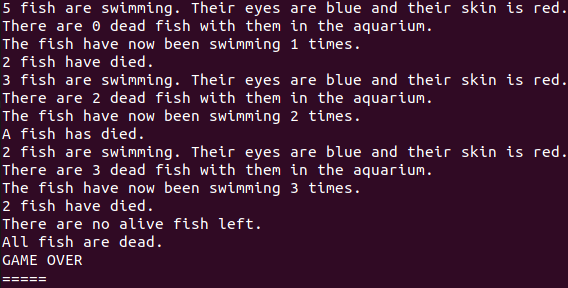

# Python OOP Concepts - The Aquarium App

A friend of yours has created a little program in Python to try to simulate what is happening in an aquarium. Unfortunately, your friend did not pay much attention to naming conventions  while studying Python. So while the program is working, as it should, it is not following coming naming conventions and therefore it will be harder for other developers to work on in the future.

It is your task to modify the app.py file so that it follows common Python naming conventions.

When running **app.py**, the output should still look like this after your changes:

### Overview of app.py:

This file includes both the class _**aquarium_app**_ and at the bottom the main method that will run the example. You should not change the functionality of the class so the output should remain the same. You should modify the names of variables, methods, classes, etc. to match Python conventions.
